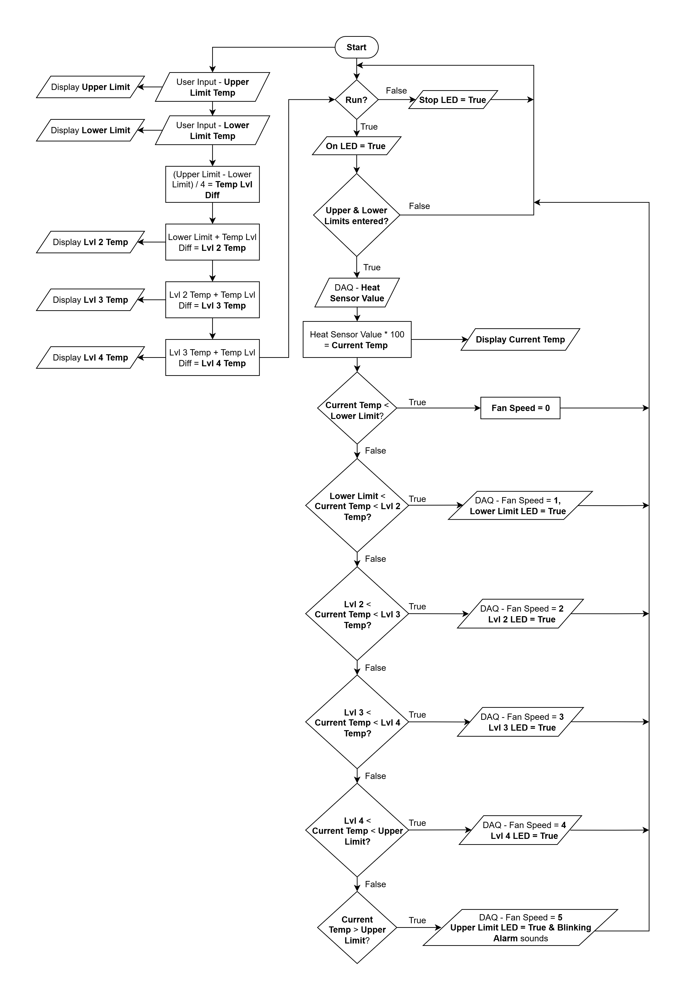
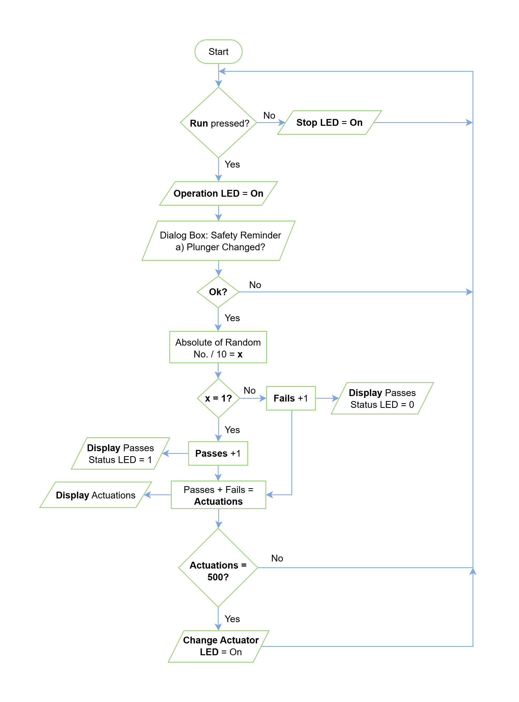
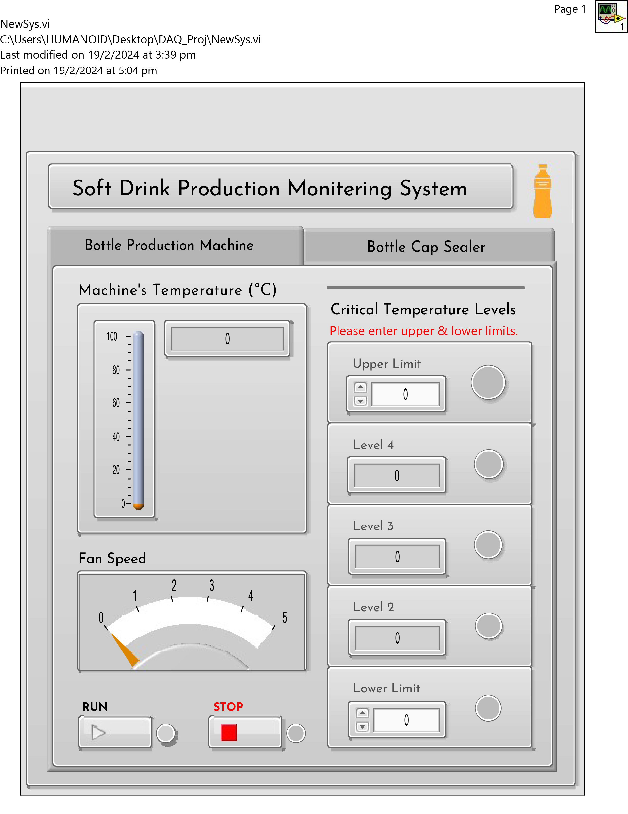
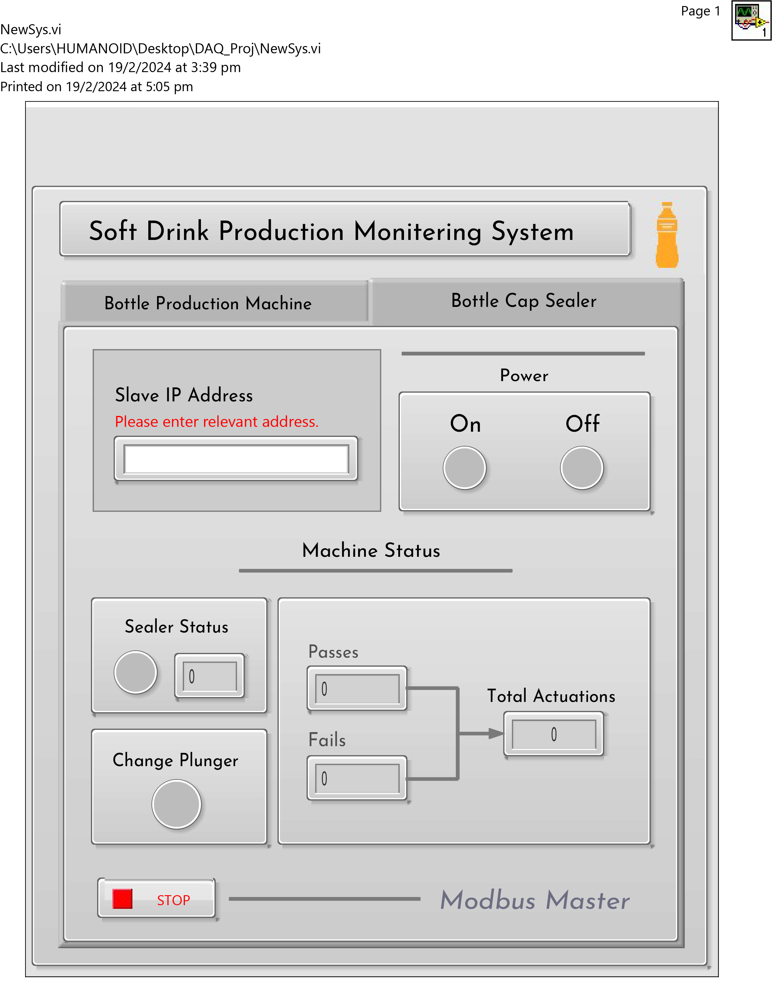
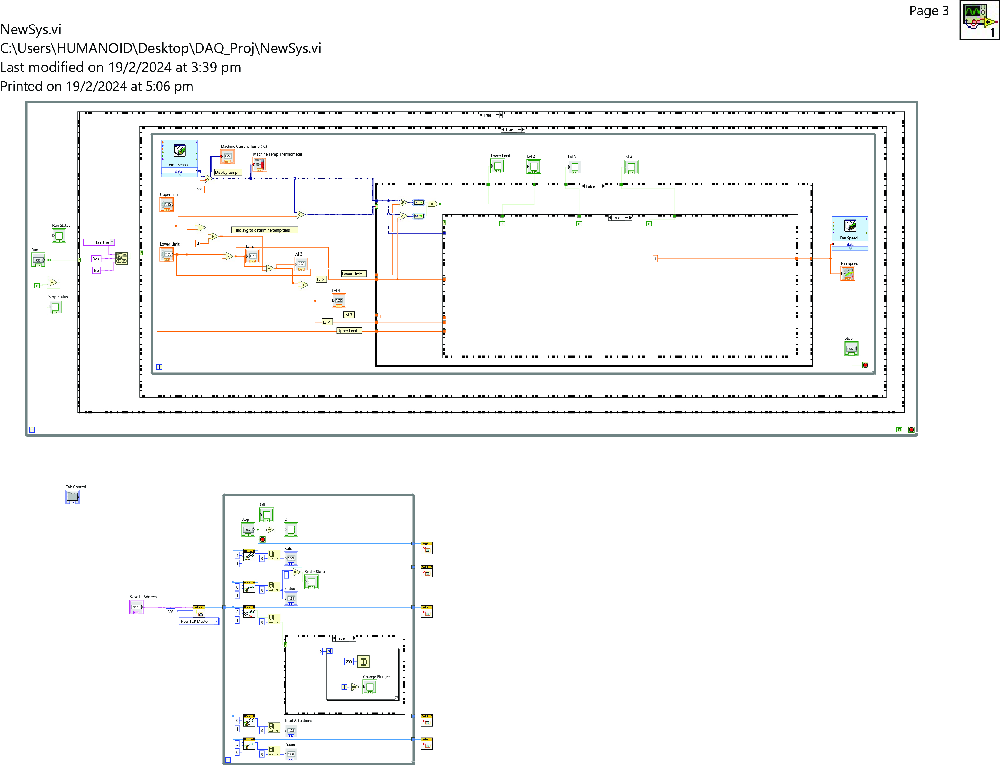
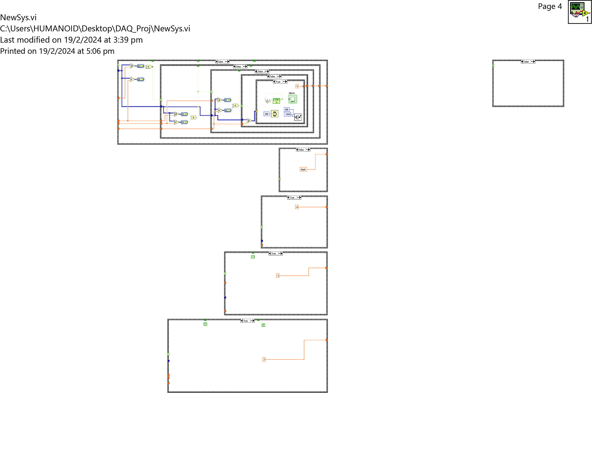
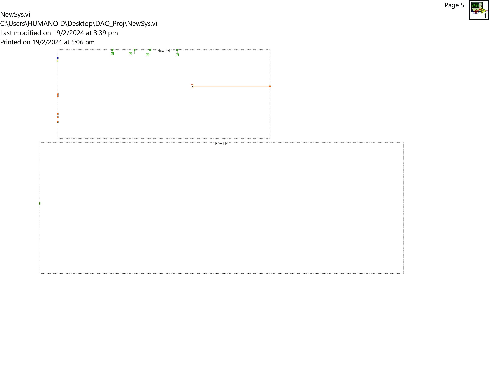
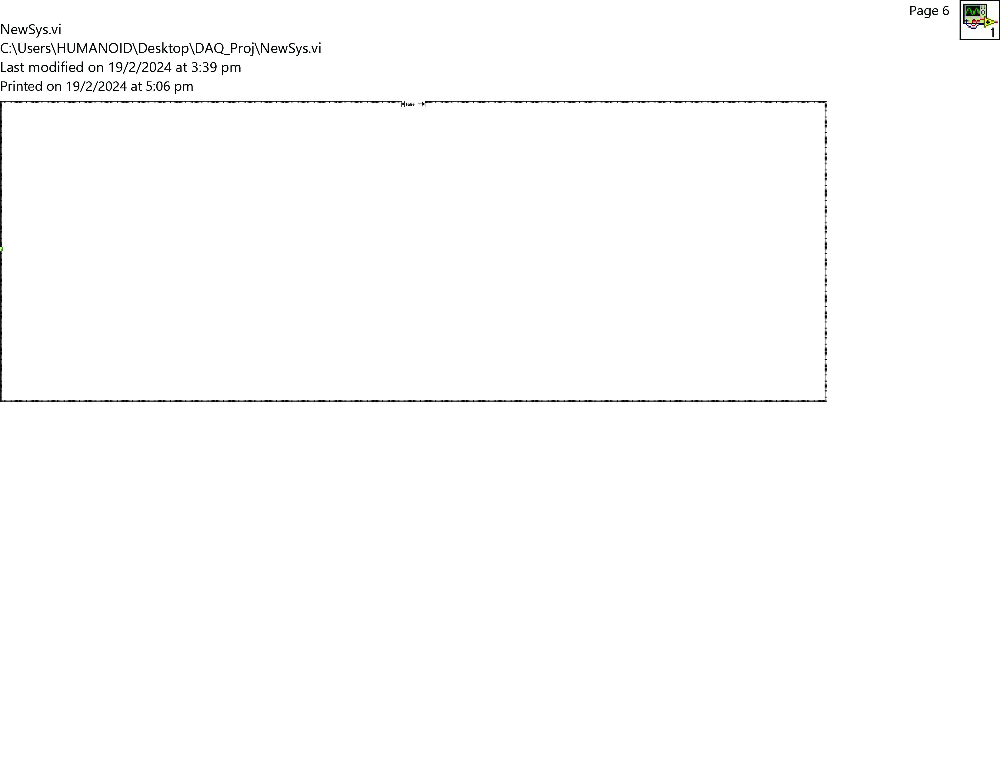
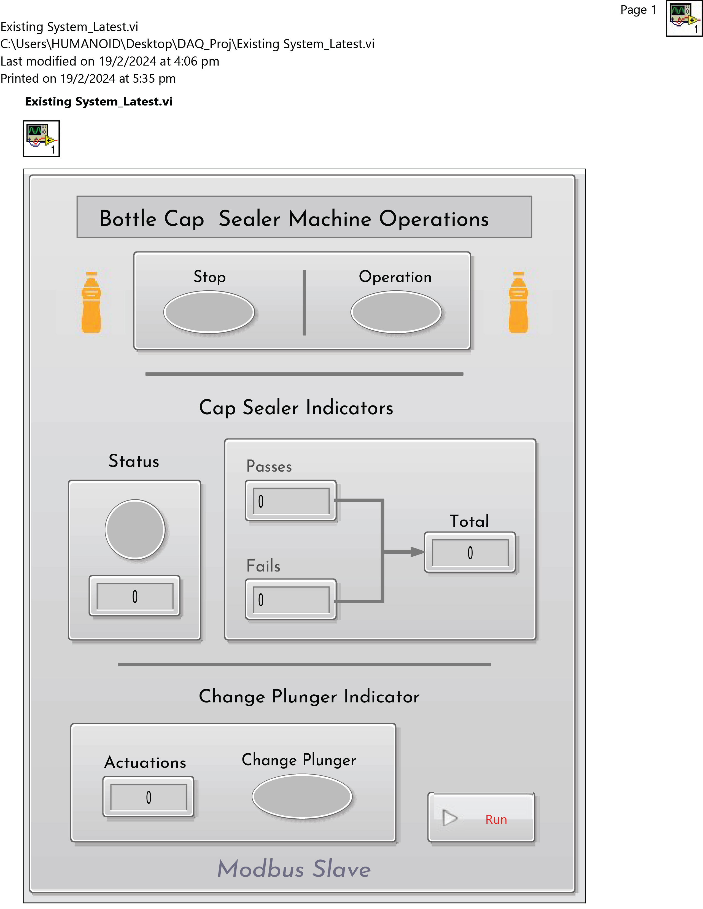
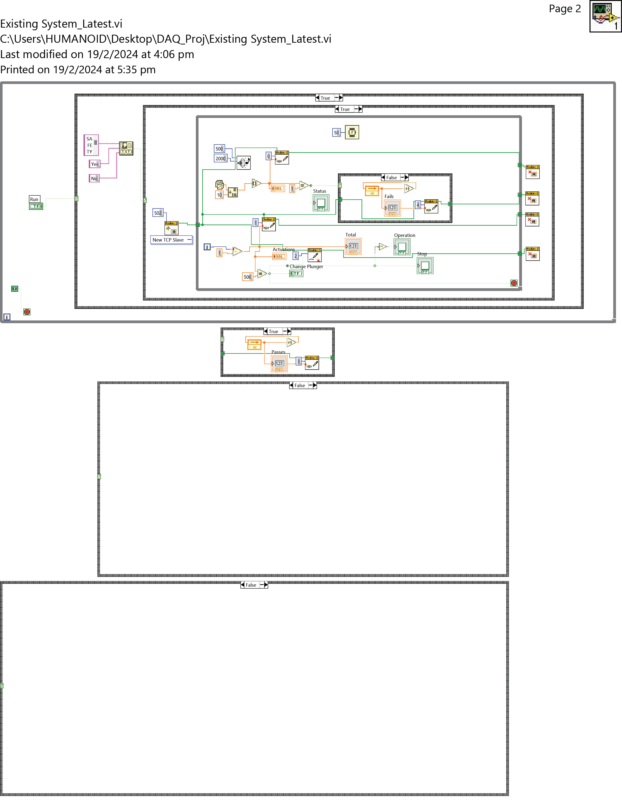

# Automated Bottle Production Machine & Automated Bottle Cap Sealer

Our team was tasked to design and create a new system to monitor the temperature of an automated bottle production machine as well as append an HMI to an existing system to track the number of times an actuator gets activated in an automated bottle cap sealer on the factory floor. The project objective was to create a fully functional soft drink monitoring system.

HMI of Automated Bottle Production Machine (New System) – This machine runs for 24 hours a day. To reduce the manpower required to supervise the machine’s temperature, we created a simple, autonomous HMI interface. This interface requires the engineer to set a minimum allowed temperature and maximum allowed temperature. Using this data, the system will calculate the 3 tiers of temperature readings in between as well. When the machine’s temperature reaches the minimum allowed, a fan will be turned on to help with cooling. If the temperature continues to rise, as it reaches each tier in between, the fan speed will increase each time. If the temperature hits the maximum allowed, an alarm will go off together with a blinking LED to alert the engineer or operator. 

Automated Bottle Cap Sealer (Existing System) – This machine has a sensor that monitors the number of times its actuator is used to seal bottles. The actuator must be replaced after being used 500 times. For demo purposes, we simulated the actuator’s activity. Our system will pause & display a message when its use has reached 500. This machine is located at a distance from the automated bottle production system which has a HMI. Using Modbus interfacing, the cap sealer will send the number of actuations in real time and display an alert on the HMI informing the engineer or operator when it needs to be replaced. Hence, it is not necessary to physically keep checking the machine.

## Requirements 

Our team gathered feedback from the supervisor and derived the following requirements:

#### Automated Bottle Production Machine HMI [New System] 

Design and put together a circuit that integrates a temperature sensor, a fan and a DAQ device to convert analog signals from the fan to digital parameters that will activate the fan and vary its speed accordingly. 

Design & create a HMI that will display the machine’s current temperature using readings from 
the temperature sensor.  

The HMI should accept user input to set the min and max temperature levels and calculate the in between levels. It will display the value of each level together with an LED. As the temperature passes each level, the corresponding LED will light up and increase the fan speed by 1, starting from the minimum level. There will be 5 temperature levels in total to correspond to the 5 different speeds of the fan. When the temperature reaches its maximum, fan speed will be set to 5, the corresponding LED will blink and sound an alarm to alert an operator. The HMI will also always display the current fan speed, and it will be turned off if the temperature is below the minimum limit.

The HMI will include an interface displaying data sent from the automated bottle cap sealer using Modbus interfacing. This will be done via a tab display, where the operator can switch back & forth between the new & existing monitoring systems. 

The HMI will display the number of actuations that the bottle cap sealer has completed as well as a status indicator LED that will turn on when the actuations reach 500 to inform the operator that it needs to be changed. 

The HMI will also display the additional information of the number of passes & fails in sealing. This data will be retrieved from the machine using holding registers in Modbus interfacing.

The operator will be required to enter the IP address of the bottle cap sealer to view that machine’s details. 

#### Automated Bottle Cap Sealer [Existing System]

The existing system will need to simulate the actuations & display the number of times the plunger has been activated. This will be done using a random number generator.

As in real life, a machine may not always successfully do its job. Hence, this system will monitor the number of failed and passed sealings and display this on its interface.  

The system will send the number of actuations, fails & passes to via Modbus TCP to the HMI on the new system. 

Once the actuations reach 500, the machine will pause and turn on an LED to indicate that the plunger needs to be changed.  

Once the plunger has been replaced and the operator presses the run button, a dialog box will pop up to help the operator confirm if the replacement has been done and it’s safe to start the next cycle. When the operator confirms this in the dialog box, the machine will start running again.

## Port Pins Assignment 

| **DAQ6008 Analog Pins** | **PIN name: Device name** | **Remarks** |
|---------------|--------------------------------------|--------------------------------------------------|
| GND           | GND                                  | - |
| AI0           | Pin 2, LM35 Temperature Sensor AI0 + | - |
| AI4           | Pin 3, LM35 Temperature Sensor AI0 - | - |
| AO0           | Pin 14, Resistor                     | To transistor & fan |

## Block Diagram

## Circuit Design Diagram

## Circuit Connections

## Operations and Features 

#### HMI of Automated Bottle Production Machine [New System]

With reference to Diagram A1, the automated bottle production machine faces a Human Machine Interface (HMI) that not only monitors the machine’s temperature but also monitors another system in another part of the factory via Modbus interfacing. This reduces the required manpower and decreases risk in safety to operators. The user can switch between the HMI for the bottle production machine & the cap sealer by tapping on the required tab.

**Features (New System - Automated Bottle Production Machine)**

• The HMI features a thermometer & numerical indicator to show the machine’s temperature in real time. This data is acquired via the DAQ device that is wired to a LM35 temperature sensor. 

• There are 2 user input fields, where the operator can input the minimum allowed temperature and the maximum allowed temperature. Given these 2 data points, the machine will calculate and display an additional 3 levels of temperature between the min and max. Each temperature level has a numeric indicator of its value and an LED. The colour of the LED corresponds to the risk level as the temperatures rise, from green to yellow, orange, red and blinking red. As the machine’s temperature rises above each level but is lower than the next level, that level’s LED will turn on. It will turn off once the temperature has risen above the next level or cooled down before its level. 

• If the temperature remains below the minimum allowed temperature, all the LEDs and the fan will be off.  

• A fan speed indicator is also present on the HMI, and it shows fan speeds from 0 to 5. The system has been programmed to take automatically certain actions once the temperature crosses the minimum allowed. The fan will be turned on at speed 1 and the minimum allowed temperature LED will turn on as well. As the temperature rises to each level, the fan speed will increase by 1. The HMI sends the corresponding signal to the DAQ to operate the motor fan to cool down the machine. 

• When the maximum temperature has been crossed, the fan speed will be at 5. The corresponding LED will blink red, and an alarm will sound to alert the operator. These will only stop once the machine has cooled down. 

**Features (New System – Modbus Master to Automated Bottle Cap Sealer)**

• The HMI features a user input field, which requires the IP address of the Modbus slave/machine to be monitored.  

• The system uses Modbus TCP to read data sent from the Modbus slave and display it. 

• The systems reads the number of “Passes”, “Fails” and “Total Actuations” via Modbus TCP and displays them on the HMI as numeric indicators so the operator can track the machine’s progress from far. 

• The HMI features a “Status” section that has an LED that lights up and a numeric display shows the number 1. If the cap is not successfully sealed, the LED will turn off and the display will show the number 0. This allows the operator to track the machine in real time. 

• There are 3 LED indicators that reads input via Modbus TCP from the slave and will turn on if the machine is running - “On”, stopped - “Off or if the actuator needs to be changed - “Change Plunger”.

#### Automated Bottle Cap Sealer [Existing System]

The existing system is in another part of the factory. The bottle cap sealer has a driver unit which is attached to the plunger to seal filled bottles with a cap. The sensor will monitor the number of times this driver unit is being activated. The current setting is set to 500 times. After 500 uses, the plunger needs to be replaced.  

With reference to **Diagram B1**: Flowchart of Bottle Cap Sealer Machine Operations, the user would need to press the ‘Run’ button to activate the machine’s operations. A green LED indicator is lights up to show the machine is on and is running.  

The machine counter will start running. There are 3 counters. One counter to indicate ‘Passes’ – its indicator shows the number of caps sealed that met the design specifications.  The ‘Fails’ indicator shows the cap seals that did not meet specifications. The ‘Total’ counter indicates the total number of ‘Passes’ and ‘Fails’. This also corresponds to the number of actuations. 

Once the machine reaches 500 actuations, the machine would stop, and an LED Indicator show a steady red light will turn on. This indicates that the machine has stopped. A second LED will show a steady orange light. This is an indication to change the plunger. Once the plunger is successfully changed, the authorised personnel would need to click “Run” once again to continue operations. A dialog box would appear on the screen to remind the authorised user to confirm the change and check if it is safe to proceed. Once, they click “Okay’’, the machine will start sealing bottles again. 

While the machine runs, the system will use Modbus TCP to write its data to the Modbus master. This include sending the number of “Passes”, “Fails”, “Total (of actuations) and indicators that show if the machine is running, has stopped or requires a change. 

**Features**

a) The design of a Graphical User Interface (GUI) is user-friendly and easy to understand with clearly labelled indicators and a button. 

b) The existing system will consists of a system that will monitor the quality of sealed caps produced. A “Status” numeric and LED indicator are used to show the machine’s results in real time. There will be 2 outputs labelled as Passes and Fails. If the production of the seal cap is successful, “Passes” is incremented by 1, the “Status” LED will light up and the numeric “Status” indicator will show a 1. When the opposite is true and the seal cap produced is unsuccessfully, “Fails” is incremented by 1, the “Status” LED will be turned off and the numeric “Status” indicator will show a 0. 

c) The configured system records the total number caps produced. 

d) The system will have a Run button to start/resume operations. The operation cycles must be completed to prevent machine jamming and to ensure the final product is extruded from the extrusion bit.  

e) The machine has a safety feature incorporated to prevent premature activation of the machine which may promote unsafe practices. A pop-up dialog box is used to remind the authorised staff to perform the necessary safety protocols such as checking that the machine plunger has been changed & conducting safety checks before activating the ‘Run’ button on the machine.

**Diagram A1**

**Diagram B1**

## Conclusion

#### Issues Encountered, Their Resolution and Limitations 

The issues encountered while doing the project are as follows: 

a) Organising team meetups while juggling work and study commitments was a challenge. It was very difficult initially, but we managed to work out solutions that were convenient for both of us and took a commitment to complete the project.  

b) Understanding the questions: We both had difficulty understanding the requirements of the project. We initially thought we had to integrate Modbus features into both machines. Fortunately, we were able to clarify this with our trainer and proceeded to plan our project flow.

We felt the equipment being issued to the team was limited. We both felt that we could not practice more on the DAQ device as much as we would have liked. We have our busy schedules and daily commitments we need to fulfil. We would have preferred if the school was able to provide an additional DAQ device much like our subject, where each student was given their own set. It would have been very helpful for the project and would help our personal learning progress. 

In the end, we had to compromise and prioritize completing the project. Any additional need to use the DAQ device had to be fulfilled at the laboratory during classes. Although we strongly felt this limited our learning. 

We would like to add that the environment in the laboratory was not conducive to learning and result in an unfortunate incident where John had a panic attack during class. He had to take leave from the laboratory. The air-circulation was very poor. He felt he just had to pack his bag and leave the premises immediately. To work around this, John had to bring his own fan from then 
on.

#### Reflection

Overall, I quite enjoyed the challenge that the project presented. Over the course of the semester, we were taught simple ways to use LabView and its related components/concepts but for the project, we were required to put together all that we had learnt in creative ways, never tried in our labs, to fulfil the project requirements. We found ourselves at multiple roadblocks and often, the knowledge that we had been given was not enough. We ended up researching for solutions and learnt some more features of LabView like event structures and dialog boxes to name a couple. We had to experiment with these new and already thought features to get the program to do what we wanted to. Both John and I had a lot of satisfying “Eureka” moments when we finally got something to work as we desired. 

It was interesting working with a graphical language and a lot of times, we found ourselves thinking in Python or C and looking for the equivalent of it in LabView. We realised that for a seemingly simple program, the block diagrams can get very complicated very fast. There is a lot to account for e.g., the behaviour of an LED light when inside and outside of specific loops.  

I would like to commend my partner John as working with him has been more than just an enjoyable experience. He was very reliable and took a lot of initiative on his own. We were both open to learning, helping each and growing together. I look forward to more opportunities working with him. 

#### Good Practices Learnt

These are some good practices we incorporated during the project: 

a) Communication: Having effective communication among team members was the key element leading to the success of our team. We communicated well and managed to juggle work and the occasional study program or assessment. 

b) Seeking Help: There were times where we misinterpreted or misunderstood the questions. We were able to clarify with each other or by ask our trainer. Seeking help when in doubt is crucial to ensure that the project gets carried out properly. 

c) Reference & Research: While coding, it was important to refer to the laboratory notes to get ideas on how to execute the program, understand limitations and possibility but we were also required to think outside the bow of knowledge we have been given, and do our own research to figure out solutions we needed. We felt that case structures in LabVIEW were particularly useful to our program flow and to solving the problem in the assessment. 

d) Code Organization: LabView can get very confusing very fast if one is does not organize their code from the beginning. It’s easy to lose track of what is where and what is doing what otherwise. Relying on the “Clean Up Diagram” option was not enough, as we would very quickly lose sight of what was where. Hence, we both made sure to track our functions and keep our code organized while we worked.  

e) Project Planning: It was crucial that we decided what we wanted to do, how we were going to do and decide on our project flow at the beginning so that we had something to refer to when we were lost. This included drawing up draft flowcharts and/or pseudo-codes to give us some direction. 

## Appendix

#### New_System.vi

#### Existing_System.vi

