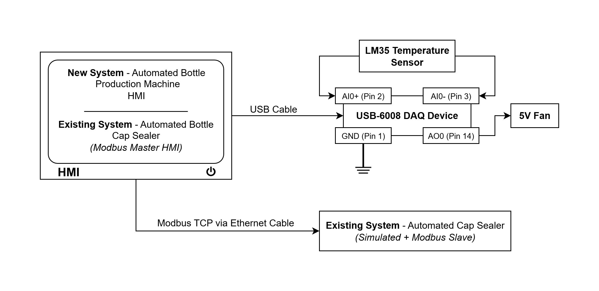
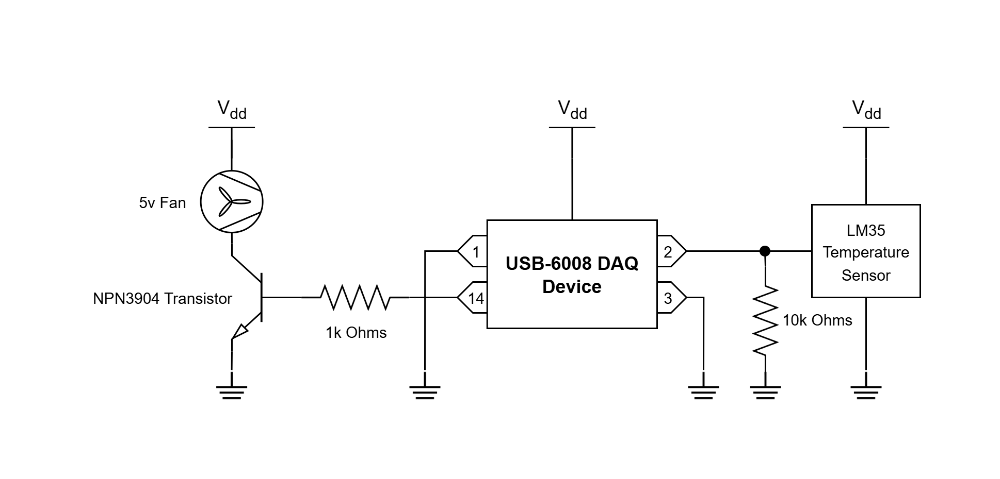
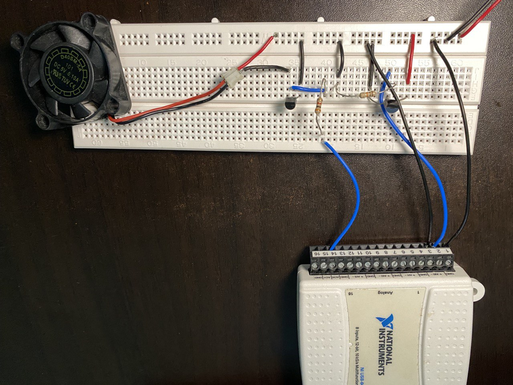
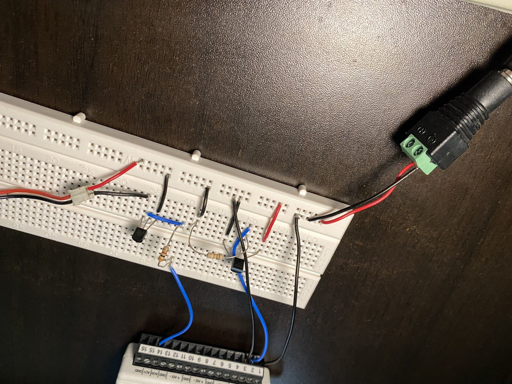
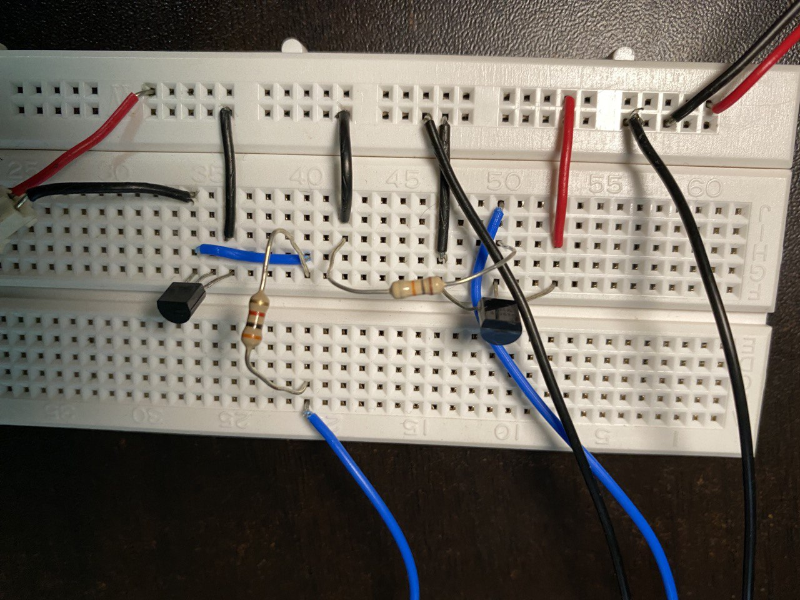
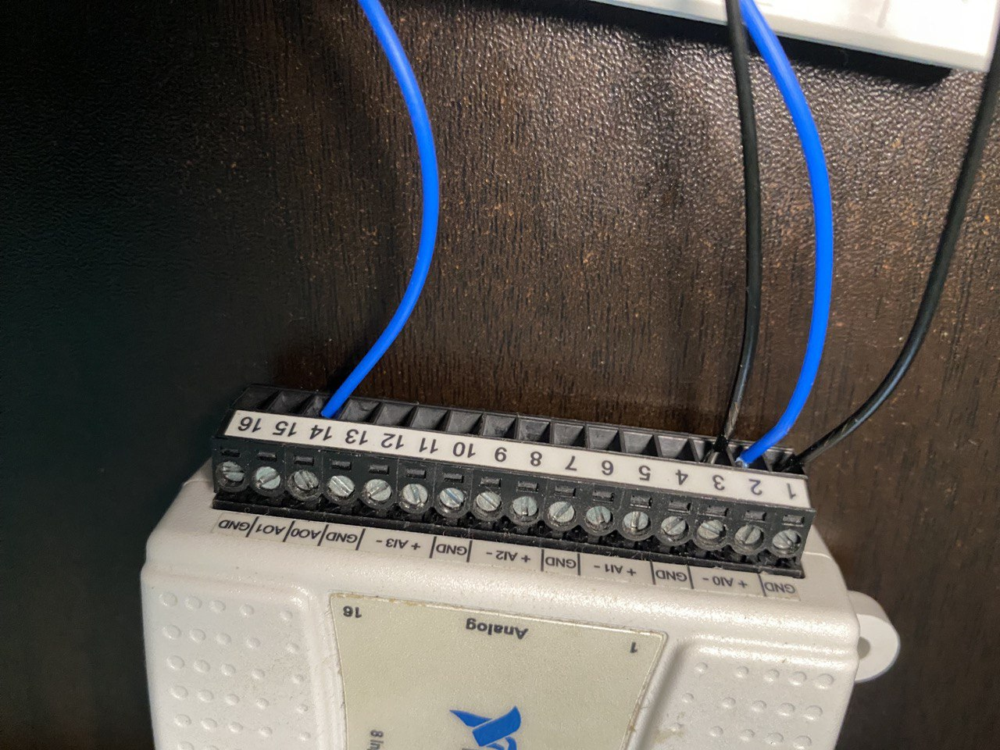

# Automated Bottle Production Machine & Automated Bottle Cap Sealer

Our team was tasked to design and create a new system to monitor the temperature of an automated bottle production machine as well as append an HMI to an existing system to track the number of times an actuator gets activated in an automated bottle cap sealer on the factory floor. The project objective was to create a fully functional soft drink monitoring system.

HMI of Automated Bottle Production Machine (New System) – This machine runs for 24 hours a day. To reduce the manpower required to supervise the machine’s temperature, we created a simple, autonomous HMI interface. This interface requires the engineer to set a minimum allowed temperature and maximum allowed temperature. Using this data, the system will calculate the 3 tiers of temperature readings in between as well. When the machine’s temperature reaches the minimum allowed, a fan will be turned on to help with cooling. If the temperature continues to rise, as it reaches each tier in between, the fan speed will increase each time. If the temperature hits the maximum allowed, an alarm will go off together with a blinking LED to alert the engineer or operator. 

Automated Bottle Cap Sealer (Existing System) – This machine has a sensor that monitors the number of times its actuator is used to seal bottles. The actuator must be replaced after being used 500 times. For demo purposes, we simulated the actuator’s activity. Our system will pause & display a message when its use has reached 500. This machine is located at a distance from the automated bottle production system which has a HMI. Using Modbus interfacing, the cap sealer will send the number of actuations in real time and display an alert on the HMI informing the engineer or operator when it needs to be replaced. Hence, it is not necessary to physically keep checking the machine.

## Requirements 

Our team gathered feedback from the supervisor and derived the following requirements:

### Automated Bottle Production Machine HMI [New System] 
Design and put together a circuit that integrates a temperature sensor, a fan and a DAQ device to convert analog signals from the fan to digital parameters that will activate the fan and vary its speed accordingly. 

Design & create a HMI that will display the machine’s current temperature using readings from 
the temperature sensor.  

The HMI should accept user input to set the min and max temperature levels and calculate the in between levels. It will display the value of each level together with an LED. As the temperature passes each level, the corresponding LED will light up and increase the fan speed by 1, starting from the minimum level. There will be 5 temperature levels in total to correspond to the 5 different speeds of the fan. When the temperature reaches its maximum, fan speed will be set to 5, the corresponding LED will blink and sound an alarm to alert an operator. The HMI will also always display the current fan speed, and it will be turned off if the temperature is below the minimum limit.

The HMI will include an interface displaying data sent from the automated bottle cap sealer using Modbus interfacing. This will be done via a tab display, where the operator can switch back & forth between the new & existing monitoring systems. 

The HMI will display the number of actuations that the bottle cap sealer has completed as well as a status indicator LED that will turn on when the actuations reach 500 to inform the operator that it needs to be changed. 

The HMI will also display the additional information of the number of passes & fails in sealing. This data will be retrieved from the machine using holding registers in Modbus interfacing.

The operator will be required to enter the IP address of the bottle cap sealer to view that machine’s details. 

### Automated Bottle Cap Sealer [Existing System]

The existing system will need to simulate the actuations & display the number of times the plunger has been activated. This will be done using a random number generator.

As in real life, a machine may not always successfully do its job. Hence, this system will monitor the number of failed and passed sealings and display this on its interface.  

The system will send the number of actuations, fails & passes to via Modbus TCP to the HMI on the new system. 

Once the actuations reach 500, the machine will pause and turn on an LED to indicate that the plunger needs to be changed.  

Once the plunger has been replaced and the operator presses the run button, a dialog box will pop up to help the operator confirm if the replacement has been done and it’s safe to start the next cycle. When the operator confirms this in the dialog box, the machine will start running again.

## Port Pins Assignment 

| **DAQ6008 Analog Pins** | **PIN name: Device name** | **Remarks** |
|---------------|--------------------------------------|--------------------------------------------------|
| GND           | GND                                  | - |
| AI0           | Pin 2, LM35 Temperature Sensor AI0 + | - |
| AI4           | Pin 3, LM35 Temperature Sensor AI0 - | - |
| AO0           | Pin 14, Resistor                     | To transistor & fan |

## Block Diagram

## Circuit Design Diagram

## Circuit Connections

## 3.1 Operations and Features 
